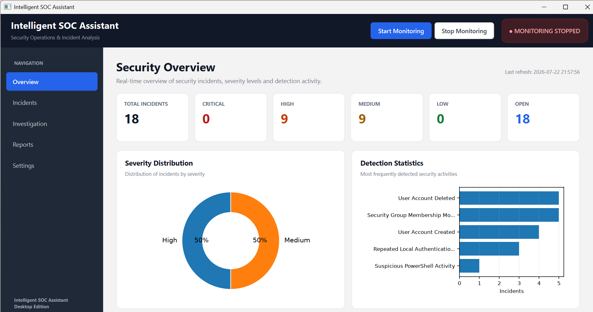
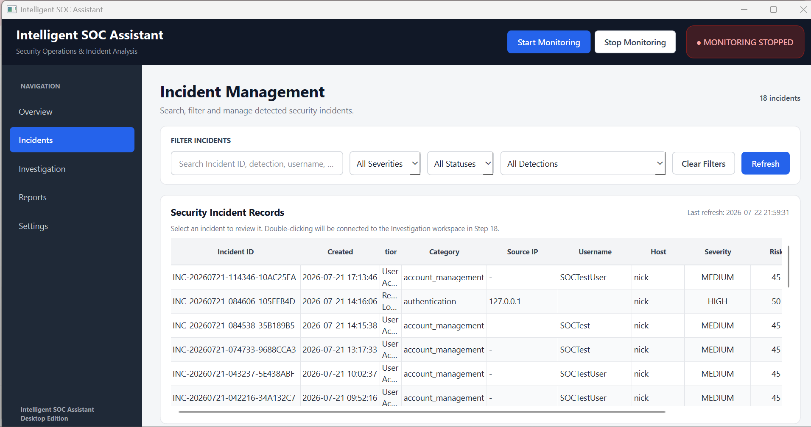
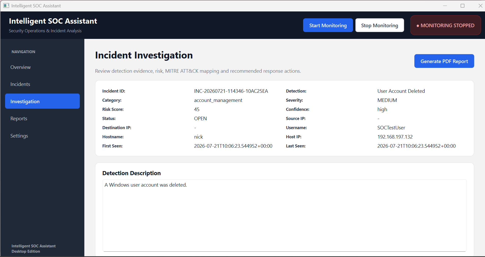
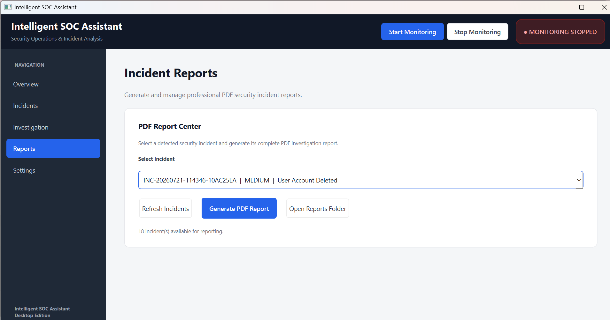

# 🛡️ Intelligent SOC Assistant

A Python-based defensive security application designed to monitor Windows security events, correlate related activity, detect suspicious behavior, prioritize incidents, map relevant detections to MITRE ATT&CK, and support SOC-style investigation through a desktop dashboard.

---

## 📌 Project Overview

The **Intelligent SOC Assistant** is a lightweight Security Operations Center (SOC) monitoring and incident analysis application developed using Python.

The project monitors security-relevant Windows events and processes them through a modular security pipeline:

**Event Collection → Parsing → Normalization → Correlation → Detection → Severity & Risk Scoring → MITRE ATT&CK Mapping → Recommendations → Storage → Investigation → Reporting**

The application provides a native desktop dashboard where security incidents can be monitored, filtered, investigated, prioritized, and documented.

The main purpose of this project is to understand how the fundamental components of a SOC monitoring pipeline work together rather than relying only on an existing SIEM interface.

---

## 💡 Why I Built This Project

My career goal is to become a **SOC Analyst**, and I wanted to understand security monitoring beyond theoretical concepts.

I started with a simple question:

> **How can I understand and detect suspicious activity occurring on a Windows system that I control?**

Before thinking about monitoring an entire organization, I wanted to understand what happens on a single endpoint:

- What security events does Windows generate?
- What information is available inside those events?
- How can raw events be converted into useful security data?
- How can related events be correlated?
- How can suspicious behavior be distinguished from normal activity?
- How should incidents be prioritized?
- How does a SOC analyst investigate an alert?

Instead of simply using an existing SIEM platform, I wanted to understand what happens behind a simplified SOC pipeline.

This led me to build individual modules for:

- Live security event collection
- Log parsing
- Event normalization
- Event correlation
- Security detection
- Severity and risk assessment
- MITRE ATT&CK enrichment
- Investigation recommendations
- Incident storage
- Dashboard visualization
- Incident reporting

The idea was to first understand defensive monitoring at the **single-endpoint level** and build a foundation that could later be extended toward larger organizational environments.

---

## 🎯 Project Objectives

The main objectives of the project are:

- Monitor Windows security events continuously.
- Collect security-relevant Windows and PowerShell events.
- Extract useful information from raw Windows Event XML.
- Normalize different event structures into a common format.
- Correlate related events before generating meaningful detections.
- Reduce unnecessary alerts and false positives.
- Detect configured security-relevant behavior.
- Assign severity, risk score, and response priority.
- Map supported detections to MITRE ATT&CK.
- Generate investigation and response recommendations.
- Store incidents persistently using SQLite.
- Provide an analyst-friendly desktop interface.
- Support incident investigation and reporting.
- Generate structured PDF incident reports.

---

## 🏗️ System Architecture

```text
Windows Security / PowerShell Events
                ↓
        Live Event Monitor
                ↓
              Parser
                ↓
            Normalizer
                ↓
        Correlation Engine
                ↓
         Detection Engine
                ↓
      Severity & Risk Engine
                ↓
       MITRE ATT&CK Mapper
                ↓
      Recommendation Engine
                ↓
       SQLite Incident DB
                ↓
       PySide6 / Qt Dashboard
                ↓
     Investigation & Reporting
```

Each module has a separate responsibility, making the application modular and easier to maintain or extend.

---

# ⚙️ How the System Works

## 1. Live Event Monitoring

The application monitors configured Windows event channels and collects security-relevant events as they are generated.

The main monitored sources include:

- Windows Security Event Log
- PowerShell Operational Event Log

The live monitor uses Windows event functionality through Python and `pywin32`.

```text
Windows generates event
        ↓
Live Monitor receives event
        ↓
Raw event XML collected
        ↓
Sent into processing pipeline
```

---

## 2. Parsing

Windows events contain structured information, commonly represented through XML.

The parser reads the raw event and extracts security-relevant fields such as:

- Event ID
- Record ID
- Timestamp
- Provider
- Channel
- Computer / hostname
- Username
- Domain
- Source IP
- Logon type
- Process information
- Authentication information
- Event-specific fields

Conceptually:

```text
Raw Windows Event XML
          ↓
        Parser
          ↓
Structured Python Event Data
```

### Parsing means:

> Extracting useful structured information from raw data.

---

## 3. Normalization

Different Windows Event IDs may represent similar information using different field names or structures.

The normalizer converts these variations into a consistent internal schema.

For example:

```text
IpAddress
SourceNetworkAddress
ClientAddress
        ↓
   Normalization
        ↓
source_ip
```

This allows downstream modules to process events consistently.

### Normalization means:

> Converting data into a common and standardized format.

---

## 4. Correlation

A single security event does not always represent an attack.

For example, one failed password attempt may simply be a user mistake.

The correlation engine connects related events using factors such as:

- Event type
- Time window
- Username
- Host
- Source information
- Authentication context
- Threshold
- Cooldown logic

Example:

```text
Failed Login #1
        ↓
No incident

Failed Login #2
        ↓
No incident

Failed Login #3
        ↓
Correlation threshold reached
        ↓
Related authentication events correlated
        ↓
One meaningful security detection
```

### Correlation means:

> Connecting related security events to identify a meaningful behavioral pattern.

This helps reduce alert flooding and unnecessary incidents.

---

## 5. Detection Engine

The detection engine analyzes normalized events and correlated activity using rule-based and context-aware detection logic.

The project follows an important security principle:

> **A Windows Event ID is security telemetry, not automatic proof of an attack.**

The detection engine therefore considers event context before creating a security detection.

Examples of supported security-relevant scenarios include:

- Repeated authentication failures
- Potential brute-force behavior
- Suspicious PowerShell activity
- User account creation
- User account deletion
- Security group membership modification
- New service installation where supported
- Scheduled task activity where supported
- Security audit log clearing

---

## 6. Severity and Risk Assessment

Once suspicious activity is detected, the incident is prioritized.

The system assigns information such as:

- Severity
- Risk score
- Response priority

Example:

```text
Detection
    ↓
Severity Assessment
    ↓
Risk Score
    ↓
Response Priority
```

This reflects an important SOC concept:

> Not every incident has the same level of risk.

Prioritization helps analysts determine which incidents should be investigated first.

---

## 7. MITRE ATT&CK Mapping

Supported detections are enriched using the **MITRE ATT&CK framework**.

MITRE ATT&CK provides a standardized way to describe adversary:

- Tactics
- Techniques
- Sub-techniques

Examples used by supported detection logic may include:

| Behavior | MITRE ATT&CK |
|---|---|
| Brute-force behavior | T1110 — Brute Force |
| Suspicious PowerShell | T1059.001 — PowerShell |
| Local account creation | T1136.001 — Create Account: Local Account |
| Account / group manipulation | T1098 — Account Manipulation |
| Windows event-log clearing | T1070.001 — Clear Windows Event Logs |

MITRE mapping is based on **detected behavior and context**.

An Event ID alone does not automatically prove that a MITRE technique occurred maliciously.

---

## 8. Recommendation Engine

After an incident is detected, the recommendation engine provides investigation and response guidance.

Recommendations may help the analyst determine:

- What should be checked?
- Which account should be investigated?
- Which endpoint is involved?
- Whether related events should be reviewed.
- Whether credentials or privileges should be examined.
- What containment or follow-up actions may be appropriate.

This helps transform a raw alert into more useful investigation context.

---

## 9. Incident Storage

Security incidents are stored using **SQLite**.

Stored information can include:

- Incident ID
- Detection type
- Detection category
- Timestamp
- Severity
- Risk score
- Response priority
- Username
- Source IP
- Host information
- Evidence
- Record IDs
- MITRE ATT&CK information
- Recommendations

SQLite was selected because it is:

- Lightweight
- Serverless
- Easy to integrate with Python
- Suitable for a standalone project prototype

Runtime database files are excluded from the public GitHub repository.

---

## 10. Desktop Dashboard

The project uses **PySide6 / Qt** to provide a native desktop Graphical User Interface (GUI).

The dashboard provides:

- Security overview
- KPI cards
- Severity statistics
- Incident statistics
- Charts
- Incident management
- Search and filtering
- Incident investigation
- MITRE ATT&CK information
- Evidence
- Recommendations
- Report generation
- Monitoring controls

---

# 📊 Dashboard Preview

## Security Overview

The Security Overview provides a quick view of the current security posture using KPI cards, incident statistics, severity information, and visualizations.



---

## Incident Management

The Incident Management page allows the analyst to review, search, filter, and prioritize detected security incidents.



---

## Incident Investigation

The Investigation page provides detailed context about a selected incident, including:

- Detection information
- Severity
- Risk score
- Source and host details
- Evidence
- MITRE ATT&CK mapping
- Recommendations



---

## Report Center

The Report Center supports incident documentation and PDF report generation.



---

# 🛠️ Technologies Used

| Technology | Purpose |
|---|---|
| **Python** | Core backend and security-processing logic |
| **pywin32 / Windows APIs** | Access Windows Event Logs programmatically |
| **XML Processing** | Parse structured Windows event data |
| **PySide6 / Qt** | Native desktop GUI |
| **SQLite** | Persistent local incident storage |
| **Matplotlib** | Security charts and visualizations |
| **MITRE ATT&CK** | Standardized adversary behavior mapping |
| **ReportLab** | PDF incident report generation |
| **PyInstaller** | Package the Python application as a Windows executable |
| **venv** | Isolated Python project environment |

---

# 💻 Frontend and Backend

## Backend

The backend is primarily implemented using **Python**.

It handles:

```text
Event Collection
      ↓
Parsing
      ↓
Normalization
      ↓
Correlation
      ↓
Detection
      ↓
Severity / Risk
      ↓
MITRE Mapping
      ↓
Recommendations
      ↓
Database Storage
      ↓
Reporting
```

## Frontend

The frontend is implemented using:

**PySide6 / Qt**

It provides:

- Windows
- Buttons
- Navigation
- KPI cards
- Incident tables
- Search and filters
- Investigation views
- Report controls

**Matplotlib** is used for charts and visualizations.

Because this is a standalone Python desktop application, the frontend and backend are integrated within the same application rather than requiring a separate REST API server.

---

# 🔍 Security Detection Scenarios

The application was tested using controlled security-related activities in an authorized environment.

Examples include:

| Scenario | Relevant Event ID(s) | Purpose |
|---|---:|---|
| Repeated authentication failures | 4625 | Validate correlation of multiple failed logins |
| Suspicious PowerShell activity | 4104 | Analyze suspicious script-block indicators |
| User account creation | 4720 | Monitor account creation activity |
| User account deletion | 4726 | Monitor account deletion activity |
| Security group membership modification | 4728 / 4732 | Monitor security-group changes |
| Security audit log clearing | 1102 | Detect audit-log clearing activity |

More information is available in:

`docs/DETECTION_SCENARIOS.md`

---

# 🧠 Example: Authentication Correlation

One of the important design decisions was avoiding one incident for every individual failed authentication event.

```text
Event ID 4625
Failed Login #1
        ↓
No correlated incident

Event ID 4625
Failed Login #2
        ↓
No correlated incident

Event ID 4625
Failed Login #3
        ↓
Configured correlation threshold reached
        ↓
One correlated authentication detection
        ↓
Severity + Risk Assessment
        ↓
Incident Created
```

This demonstrates an important SOC principle:

> **A security event is not always an incident. Context and correlation are required to understand behavior.**

The project can also distinguish authentication context, such as local versus remote activity, when the required event information is available.

---

# 📁 Project Structure

```text
Intelligent-SOC-Assistant/
│
├── dashboard/
│   └── dashboard.py
│
├── database/
│   ├── database.py
│   └── schema.sql
│
├── detection/
│   ├── correlation_engine.py
│   └── detection_engine.py
│
├── docs/
│   └── DETECTION_SCENARIOS.md
│
├── live_monitor/
│   ├── state_manager.py
│   └── windows_event_monitor.py
│
├── mitre/
│   └── live_mitre_mapper.py
│
├── normalizer/
│   └── windows_normalizer.py
│
├── parser/
│   └── parser.py
│
├── recommendation/
│   └── recommendation.py
│
├── reports/
│   └── report_generator.py
│
├── screenshots/
│   ├── security_overview.png
│   ├── incident_management.png
│   ├── incident_investigation.png
│   └── report_center.png
│
├── severity/
│   └── severity.py
│
├── .gitignore
├── main.py
├── README.md
└── requirements.txt
```

---

# 📦 Requirements

The main Python dependencies are:

```text
pywin32
PySide6
matplotlib
reportlab
PyInstaller
```

Python standard-library modules such as SQLite and XML-processing functionality do not require separate installation.

---

# 🚀 Installation and Setup

## Prerequisites

Before running the application, ensure you have:

- Windows operating system
- Python 3 installed
- Git installed
- Required Windows auditing/event logging enabled
- Appropriate permissions for accessing monitored Windows Event Logs

---

## 1. Clone the Repository

```bash
git clone <YOUR-GITHUB-REPOSITORY-URL>
cd Intelligent-SOC-Assistant
```

Replace `<YOUR-GITHUB-REPOSITORY-URL>` with the actual repository URL.

---

## 2. Create a Virtual Environment

```bash
python -m venv venv
```

---

## 3. Activate the Virtual Environment

Using PowerShell:

```powershell
.\venv\Scripts\Activate.ps1
```

After activation, the terminal should show:

```text
(venv)
```

A virtual environment isolates the project's Python dependencies from other Python projects installed on the computer.

---

## 4. Install Dependencies

```bash
pip install -r requirements.txt
```

---

## 5. Run the Application

```bash
python main.py
```

The PySide6 desktop application should open.

Depending on Windows Event Log permissions and the channels being monitored, appropriate privileges may be required.

---

# 🧪 Testing Approach

Security tests for this project are intended only for systems that are owned by the tester or where explicit authorization has been provided.

The project focuses on the **defensive / Blue Team perspective**:

```text
Controlled Security Activity
          ↓
Windows Generates Telemetry
          ↓
Live Event Collection
          ↓
Parsing & Normalization
          ↓
Correlation
          ↓
Detection
          ↓
Severity + MITRE
          ↓
Incident Investigation
          ↓
Defensive Learning
```

The purpose of testing is not exploitation.

The purpose is to understand:

> **What security telemetry is generated, how suspicious behavior can be detected, and how an analyst can investigate it.**

---

# 🛡️ Defensive Security Approach

This project was designed from a **Blue Team / SOC perspective**.

The idea is:

```text
Understand My Own Endpoint
          ↓
Understand Security Logs
          ↓
Monitor Activity
          ↓
Detect Suspicious Behavior
          ↓
Correlate Evidence
          ↓
Investigate Incidents
          ↓
Improve Defensive Knowledge
          ↓
Scale Toward Organizational Security
```

The current implementation focuses primarily on a Windows endpoint.

At organizational scale, similar concepts could be extended to collect telemetry from:

- Employee endpoints
- Windows servers
- Linux systems
- Firewalls
- IDS/IPS
- EDR platforms
- Network devices
- Cloud environments

---

# 🚧 Challenges Faced

Developing the project involved several technical challenges.

## Windows Event Understanding

Windows security events contain complex XML structures, and different Event IDs provide different fields.

This required understanding:

- Event IDs
- EventData fields
- User/account fields
- Authentication fields
- IP information
- Logon types
- Process information

---

## Accurate Parsing

Not every event contains the same fields.

The parser needed to safely extract useful information without assuming every field would always exist.

---

## Normalization

Similar information can appear under different field names.

A normalization layer was required to create a consistent internal event structure.

---

## False Positive Reduction

One of the biggest challenges was preventing normal activity from automatically becoming a security incident.

For example:

```text
One wrong password
≠
Automatic brute-force attack
```

Correlation, thresholds, context, and cooldown logic were introduced to improve detection quality.

---

## Event Correlation

Related events needed to be connected using:

- Time
- Event type
- User
- Host
- Source
- Threshold
- Authentication context

This was especially important for repeated authentication failures.

---

## MITRE ATT&CK Mapping

Another challenge was ensuring that MITRE mappings were based on security behavior rather than simply mapping every Event ID directly to an attack technique.

---

## Module Integration

The application contains multiple modules:

```text
Monitor
Parser
Normalizer
Correlation
Detection
Severity
MITRE
Recommendations
Database
Dashboard
Reports
```

Integrating them into one continuous pipeline required significant debugging and testing.

---

## Desktop GUI Integration

The dashboard needed to remain responsive while live monitoring was running.

This required careful integration between monitoring logic and the PySide6 interface.

---

## Database and Reporting

Incident data needed to be:

- Stored correctly
- Retrieved correctly
- Displayed correctly
- Investigated
- Converted into structured PDF reports

---

# 📚 What I Learned

This project gave me practical exposure to:

- Windows Security Event Logs
- Windows Event IDs
- Windows Event XML
- Event parsing
- Security log normalization
- Event correlation
- Rule-based detection
- Detection engineering fundamentals
- False-positive reduction
- SOC monitoring workflows
- Alert triage
- Severity assessment
- Risk prioritization
- MITRE ATT&CK
- Incident investigation
- Security recommendations
- SQLite integration
- PySide6 desktop development
- Security visualization
- PDF incident reporting
- Python module integration
- Debugging a multi-module security application

One of the most important lessons from this project was:

> **Detection is not simply matching an Event ID. Effective security monitoring requires context, correlation, evidence, and analyst judgment.**

---

# ⚠️ Current Limitations

The project is a learning-oriented SOC prototype and currently has some limitations:

- Primarily focused on Windows endpoint telemetry.
- Detection is mainly rule-based and context-based.
- Event visibility depends on enabled Windows auditing.
- Some detections require specific Windows logging configurations.
- SQLite is suitable for standalone/local use but not designed for large enterprise-scale ingestion.
- The project does not replace enterprise SIEM or EDR solutions.
- MITRE ATT&CK mapping is limited to supported detections.
- Automated containment and response capabilities are limited.

These limitations provide opportunities for future development.

---

# 🔮 Future Scope

Possible future improvements include:

- Multi-endpoint centralized monitoring
- Sysmon integration
- Linux log monitoring
- Firewall telemetry
- IDS/IPS integration
- EDR integration
- Cloud security logs
- Threat intelligence integration
- IOC enrichment
- Additional behavioral detection rules
- Ransomware behavior detection
- Machine-learning-assisted anomaly detection
- Centralized scalable storage
- Email or messaging alerts
- Case management
- Analyst notes and workflow tracking
- SOAR-style automated response
- Enhanced reporting
- Advanced detection analytics

A future organizational architecture could look like:

```text
Endpoints ─────────┐
Servers ───────────┤
Firewalls ─────────┤
IDS / IPS ─────────┤
EDR ───────────────┤
Cloud Logs ────────┘
        ↓
Centralized Log Collection
        ↓
Parsing & Normalization
        ↓
Correlation & Detection
        ↓
Threat Intelligence
        ↓
MITRE ATT&CK Enrichment
        ↓
Risk Prioritization
        ↓
SOC Analyst Investigation
        ↓
Incident Response
```

---

# 🎯 Connection to My Career Goal

My goal is to build my career as a **SOC Analyst**.

I approached this project from a defensive-security perspective:

```text
Learn Cybersecurity Fundamentals
        ↓
Understand Windows Security Logs
        ↓
Monitor My Own Environment
        ↓
Detect Suspicious Behavior
        ↓
Correlate Security Evidence
        ↓
Investigate Incidents
        ↓
Understand SOC Operations
        ↓
Develop Blue Team Skills
        ↓
Scale Knowledge Toward
Organizational Security
```

Instead of only learning how to use a security tool, this project helped me understand the purpose of the components behind a simplified SOC monitoring pipeline.

It provided practical exposure to:

**Monitoring → Detection → Triage → Investigation → MITRE ATT&CK → Response Recommendations → Reporting**

This project represents one step in my continued journey toward becoming a SOC Analyst and developing stronger skills in defensive cybersecurity.

---

# ⚠️ Disclaimer

This project is developed strictly for:

- Educational purposes
- Defensive cybersecurity learning
- Authorized security testing
- SOC and Blue Team skill development

Security-testing examples should only be performed on systems that you own or have explicit permission to test.

This application is a learning-oriented security monitoring prototype and is **not intended to replace enterprise SIEM, EDR, or SOC platforms**.

---

# 👩‍💻 Author

**Navya Sree K**

Cybersecurity Student | Aspiring SOC Analyst

Interested in:

- Security Operations Center (SOC)
- Blue Team Security
- Threat Detection
- Incident Investigation
- Detection Engineering
- Incident Response
- Defensive Cybersecurity

---

## ⭐ Project Vision

> **Monitor. Detect. Correlate. Investigate. Respond. Defend.**

The goal of this project is to continue learning how security telemetry can be transformed into meaningful information that helps analysts understand and respond to suspicious activity.

If you find this project useful for learning about SOC operations and defensive cybersecurity, consider giving the repository a ⭐.